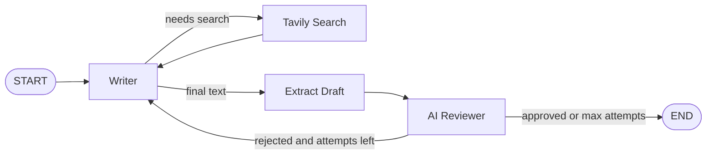
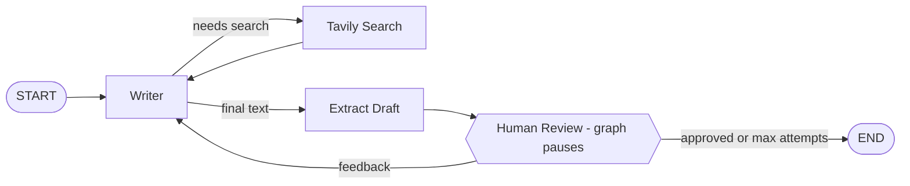

# 🚀 LinkedIn Post Generator (LangGraph)

An AI agent that writes LinkedIn posts, researches the web when it needs fresh facts, and improves the draft in a loop until it is publish-ready. Built with **LangGraph**, **Groq**, and **Tavily**, with colourful **Streamlit** UIs.

There are two workflows:

| Version | Who reviews the draft? | Console file | UI file |
|---|---|---|---|
| **Iterative (AI reviewer)** | A second LLM approves or rejects with feedback | `iterative_tools.py` | `linkedin_ui.py` |
| **Human-in-the-Loop** | You approve or give feedback | `humanintheloop.py` | `humanintheloop_ui.py` |

## ✨ Features

- ✍️ **Writer agent** that follows LinkedIn best practices (strong hook, short paragraphs, 150-200 words, CTA, no hashtags)
- 🔍 **Live web search** via Tavily, used only when the topic needs current information
- 🔁 **Iterative loop** where the draft is reviewed, rewritten with feedback, and re-checked (max attempts configurable)
- 🧑‍💻 **Human-in-the-loop** using LangGraph `interrupt()` and `Command(resume=...)`, with a checkpointer to pause and resume
- 🎨 **Streamlit UI** with animated gradient, glass cards, live pipeline tracker, and hover buttons

## 🧠 How It Works

### Iterative workflow (AI reviewer)



### Human-in-the-loop workflow



## 🛠️ Tech Stack

- **Orchestration:** LangGraph, LangChain
- **LLM:** Groq (`openai/gpt-oss-120b`)
- **Search:** Tavily
- **UI:** Streamlit
- **Language:** Python 3.10+

## ⚙️ Setup

```bash
# 1. Clone the repo
git clone https://github.com/<your-username>/<your-repo>.git
cd <your-repo>

# 2. Create and activate a virtual environment
python -m venv .venv
.venv\Scripts\activate          # Windows
# source .venv/bin/activate     # macOS / Linux

# 3. Install dependencies
pip install streamlit langgraph langchain-core langchain-groq langchain-tavily python-dotenv
```

### 🔐 API keys

Create a `.env` file in the project root (it is git-ignored, so it will never be pushed):

```env
GROQ_API_KEY=your_groq_key_here
TAVILY_API_KEY=your_tavily_key_here
```

Get keys from [Groq Console](https://console.groq.com) and [Tavily](https://tavily.com).

## ▶️ Run

**Streamlit UI (recommended)**

```bash
streamlit run iterativetools_ui.py            # AI reviewer version
streamlit run humanintheloop_UI.py      # Human-in-the-loop version
```

**Console versions**

```bash
python iterative_tools.py
python humanintheloop.py
```

## 📁 Project Structure

```
.
├── iterative_tools.py        # Writer + Tavily + AI reviewer (console)
├── humanintheloop.py         # Writer + Tavily + human review (console)
├── linkedin_ui.py            # Streamlit UI for the AI-reviewer workflow
├── humanintheloop_ui.py      # Streamlit UI for the human-in-the-loop workflow
├── .env.example              # Template for required keys (no real values)
├── .gitignore
└── README.md
```

## 💡 Key Concepts Used

- **`StateGraph` with a typed `State`** shared across all nodes
- **Conditional edges** for tool routing and for the approve / retry / stop decision
- **`ToolNode`** to execute Tavily searches requested by the LLM
- **`interrupt()` + `Command(resume=...)` + `MemorySaver`** for pausing the graph and resuming it after human input
- **`app.stream(..., stream_mode="updates")`** to update the UI as each node finishes

## 🗺️ Roadmap

- [ ] Persist checkpoints with `SqliteSaver`
- [ ] Tone and audience selector (founder, student, recruiter)
- [ ] One-click copy and export to `.txt`
- [ ] Deploy on Streamlit Community Cloud

## 🤝 Contributing

Suggestions and pull requests are welcome. Please open an issue first to discuss major changes.

## 👤 Author

**Mohd Aazib Qureshi**
Aspiring AI / Full Stack AI Engineer

⭐ If this project helped you, consider giving it a star!
